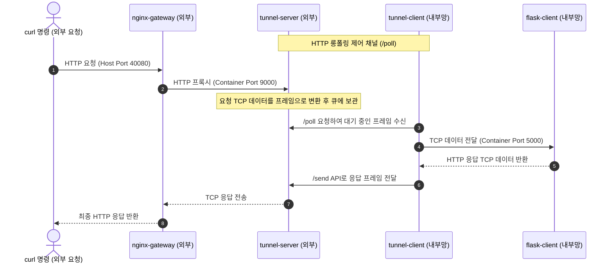

# http-tunnel (Go + Docker)

HTTP-only(롱폴링) 방식 역방향 터널의 Go 구현 + Docker 이미지입니다.
멀티스테이지 빌드로 `scratch` 베이스의 최소 이미지를 만듭니다(수 MB 수준).

## 1. 네트워크 구조 (Network Architecture)

질문하신 흐름이 맞습니다! 실제 사용자의 요청(Request)은 **오른쪽에서 왼쪽**으로 흘러가고, 응답(Response)은 다시 **왼쪽에서 오른쪽**으로 반환됩니다.

```
[내부망 (Private Network / NAT)]                               │ [외부망 (Public Server / Host)]
                                                               │
   flask-client <── 5. tunnel-client <── 4. tunnel-server <── 3. nginx-gateway <── 2. curl 명령
   (5000 포트)          (내부망)            (9000/8080 포트)      (40080:80 포트)        (외부 요청)
```

### 상세 요청 흐름 시퀀스


* **Server-side (외부망)**: Nginx와 `tunnel-server`가 위치하며, 외부 실제 요청을 받아들이는 게이트웨이 역할을 합니다.
* **Client-side (내부망 / NAT 뒤)**: `tunnel-client`와 실제 보호 대상인 로컬 서비스(`flask-client`)가 위치합니다. 클라이언트가 외부 서버에 아웃바운드로 지속적인 HTTP 폴링을 시도하여 방화벽을 우회합니다.

## 2. 프로젝트 구조

```
http-tunnel/
├── client/
│   ├── main.go
│   ├── Dockerfile
│   └── .dockerignore
├── server/
│   ├── main.go
│   ├── Dockerfile
│   └── .dockerignore
├── nginx/
│   ├── nginx.conf
│   └── Dockerfile
├── flask-client/
│   ├── app.py
│   └── Dockerfile
└── docker-compose.yml   # 데모/테스트용
```

## 이미지 빌드

```bash
# 서버 (공개 서버에 배포할 이미지)
docker build -t http-tunnel-server ./server

# 클라이언트 (내부망/NAT 뒤에 배포할 이미지)
docker build -t http-tunnel-client ./client

# 테스트용 Flask 클라이언트 이미지
docker build -t http-tunnel-flask-client ./flask-client
```

멀티 아키텍처(예: ARM 서버/라즈베리파이 등)로 빌드하려면:

```bash
docker buildx build --platform linux/amd64,linux/arm64 -t http-tunnel-server ./server --push
```

## 실행

**서버 (공개 서버):**
```bash
docker run -d \
  -e AUTH_TOKEN=원하는비밀값 \
  -p 9000:9000 \
  -p 8080:8080 \
  --name tunnel-server \
  http-tunnel-server
```
> `8080`(API 포트)은 보통 nginx 리버스 프록시 뒤에만 두고 호스트에 직접 노출하지
> 않는 걸 권장합니다. `9000`(공개 포트)만 실제 서비스 용도로 외부에 엽니다.

**클라이언트 (내부망):**
```bash
docker run -d \
  -e SERVER_URL=https://your-domain.com \
  -e AUTH_TOKEN=원하는비밀값 \
  -e LOCAL_HOST=host.docker.internal \
  -e LOCAL_PORT=3000 \
  -e SKIP_VERIFY=false \
  --name tunnel-client \
  http-tunnel-client
```

### ⚠️ LOCAL_HOST 관련 주의사항 (도커 네트워킹 특성)

클라이언트를 컨테이너로 띄우면 `LOCAL_HOST=127.0.0.1`은 **컨테이너 자기 자신**을
가리키게 되어 호스트나 다른 컨테이너의 서비스에 닿지 않습니다. 상황별로:

- **호스트 머신에서 도는 서비스**를 노출하고 싶다면:
  `LOCAL_HOST=host.docker.internal` (Docker Desktop은 기본 지원,
  리눅스는 `docker run --add-host=host.docker.internal:host-gateway ...` 필요)
- **같은 docker-compose 네트워크의 다른 컨테이너**라면:
  `LOCAL_HOST=서비스이름` (compose의 서비스명이 DNS로 자동 등록됨)
- **호스트 네트워크를 그대로 쓰고 싶다면**: `--network host`로 실행하고
  `LOCAL_HOST=127.0.0.1` 그대로 사용

## docker-compose로 한번에 테스트

동봉된 `docker-compose.yml`은 서버+클라이언트+Nginx 게이트웨이+실제 Flask 로컬서비스(`flask-client`)를 한 네트워크에 띄워 전체 흐름을 바로 확인할 수 있게 구성했습니다. (포트 충돌 방지를 위해 외부 노출 포트는 `40080`을 사용합니다.)

```bash
# 먼저 위 지침에 따라 이미지를 빌드한 후 실행합니다.
docker compose up -d
```

기동 후 아래처럼 Nginx 게이트웨이 포트(40080)로 요청하면 로컬 Flask 서비스의 응답이 역방향 터널을 거쳐 돌아옵니다:

```bash
curl http://localhost:40080/
# -> {"headers":{...},"location":"Client Side (Internal / NAT)","message":"Hello from Internal Flask Server (via HTTP Tunnel)!","status":"tunneled_access"}
```

운영 환경으로 옮길 때는 `docker-compose.yml`의 `tunnel-server`/`tunnel-client`를
분리해서 각각 다른 호스트에 배포하고, `SERVER_URL`을 실제 도메인으로 바꾸면 됩니다.

## 운영 체크리스트

- [ ] `AUTH_TOKEN` 기본값(`change-me`)을 실제 운영값으로 교체
- [ ] 서버 앞단에 nginx/Caddy 등으로 `https://` 종단 처리 (443 포트)
- [ ] 클라이언트의 `SERVER_URL`을 `https://`로 설정
- [ ] 자체 서명 인증서나 사설 프록시 통신 시 `SKIP_VERIFY=true` 환경 변수 활용
- [ ] `LOCAL_HOST`를 배포 환경(호스트 서비스 vs 컨테이너 서비스)에 맞게 설정
- [ ] 컨테이너 재시작 정책 설정 (`--restart unless-stopped` 등, 클라이언트 재연결 로직은
      코드에 이미 포함되어 있지만 프로세스 자체가 죽는 경우 대비)
